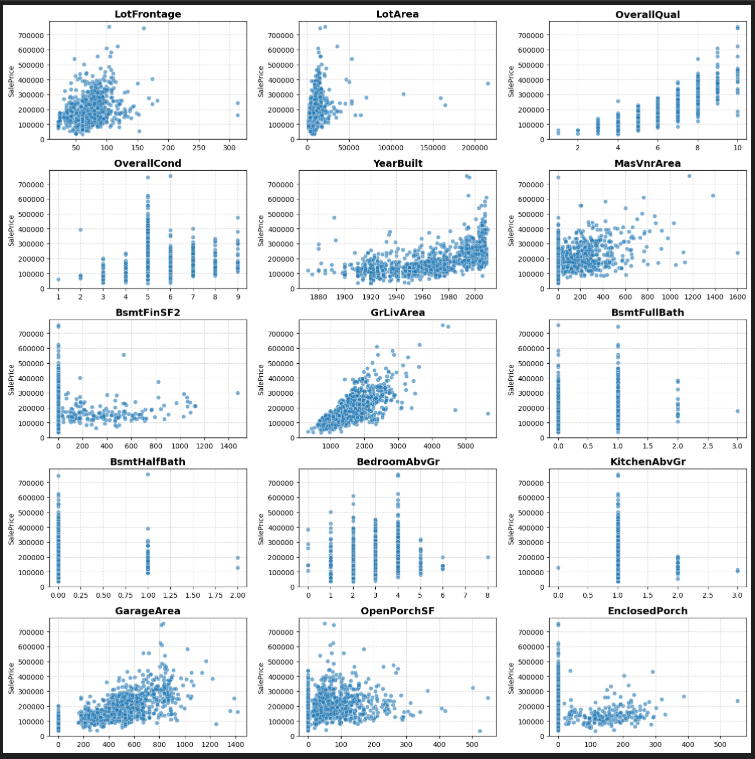
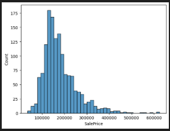
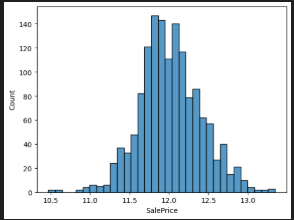
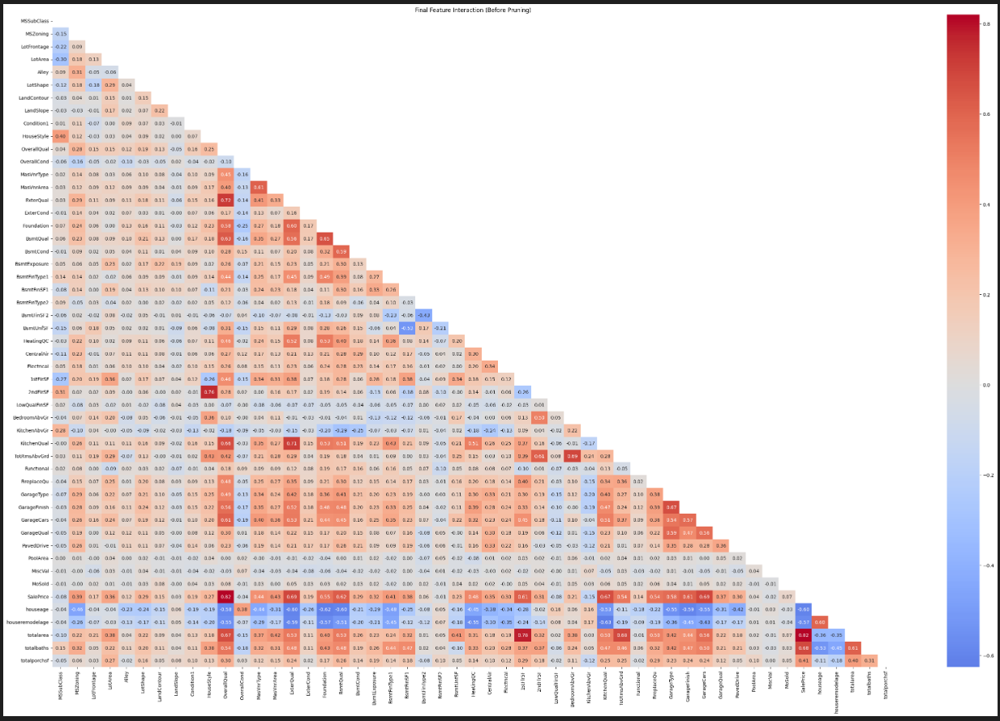

# 🏠 Ames Housing Price Prediction | Advanced Regression Techniques

This project implements an **end-to-end machine learning pipeline** for predicting house prices on the Ames Housing dataset. It combines manual ordinal encoding, target encoding, robust preprocessing, and a weighted ensemble of Ridge, CatBoost, XGBoost, LightGBM, and Gradient Boosting Regressor, with **hyperparameter tuning using Optuna**, optimized for performance and generalization.

Kaggle Public Score: **0.12260 | Top 12% (Rank 586 / 4764)**

---

## ✨ Features
- Robust **data cleaning** and **EDA-driven outlier removal**.
- Advanced **feature engineering**:
  - Manual ordinal encoding
  - Target encoding
  - New features: house age, total area, total baths, total porch area
- **Pipeline-based preprocessing** for numerical and categorical features.
- Custom **weighted ensemble** combining multiple regressors.
- **Hyperparameter tuning** for all models using **Optuna**.
- Generates Kaggle-ready submission automatically.

---

## 📋 Prerequisites
- Python 3.8+
- Libraries: `numpy`, `pandas`, `scikit-learn`, `xgboost`, `catboost`, `lightgbm`, `category_encoders`
- Dataset: Place `train.csv` and `test.csv` inside a `data/` folder

---

## 🗂️ Project Structure
```
📁 House-Price-Advanced-Regression-Techniques
├── house-prices-advanced-regression-techniques.py   # Full ML pipeline
├── house-prices-advanced-regression-techniques.ipynb   # Full ML jupyter notebook
├── data/
│   ├── train.csv
│   ├── test.csv
│   └── sample_submission.csv
├── pictures/                                        # Visualizations
│   ├── scatter.png
│   ├── target1.png
│   ├── target2.png
│   └── heatmap.png
├── submission.csv                                # Kaggle submission
├── hyperparameter_optimization.ipynb
├── requirements.txt
└── README.md
```

---

## 🚀 Getting Started
1. Clone the repository:
```bash
git clone https://github.com/radwanhefny/House-Price-Advanced-Regression-Techniques.git
cd House-Price-Advanced-Regression-Techniques
```
2. Install dependencies:
```bash
pip install -r requirements.txt
```
3. Run the pipeline script:
```bash
python house-prices-advanced-regression-techniques.py
```
- The script will automatically handle preprocessing, evaluate cross-validation RMSE in the console, and generate the final submission.csv.
- Expected Kaggle Public Score: 0.12260 | Top 12%.

---

## 🎬 Visualizations & Insights

### 📊 Scatter Plot: outlier detection 
Shows relationship between features with outliers and target variable.



### 🎯 Target Transformation 
Before and after log transformation of SalePrice.

| Before | After |
|--------|-------|
|  |  |


### 🔥 Feature Correlation Heatmap  
After dropping highly correlated features (+0.80).



---
### 🧠 Engineering Insights & Experiments
During development, multiple architectures were rigorously tested to strike the best bias-variance trade-off:

- Random Forest Baseline: Underperformed significantly in captured variance compared to boosting algorithms.
- Stacking Regressor vs. Voting: Stacking showed a high tendency to overfit the meta-features on this specific split size. A finely-tuned Weighted Voting mechanism yielded a more stable validation RMSE.
- The Linear Regression Pitfall: Integrating a standard Linear Regression model into the final ensemble degraded performance due to its severe sensitivity to minor remaining extreme feature values.

---

## ✅ Evaluation Metrics
- Root Mean Squared Error (RMSE)
- Cross-validation RMSE
- Kaggle Public Score


---

## 🤝 Contributing
Contributions are welcome!
1. Fork the repository
2. Create a new feature branch
3. Submit a pull request
Please ensure your code is clean, structured, and well-commented.


---


## 📝 License
This project is licensed under the MIT license - see the LICENSE file for details. 


---


## 📞 Support
If you have questions or need help, feel free to:
- Open an issue on this repository  
- Connect with me on LinkedIn: https://www.linkedin.com/in/radwanhefny
* **Explore my Personal Portfolio:** [radwanhefny.netlify.app](https://radwanhefny.netlify.app/)
